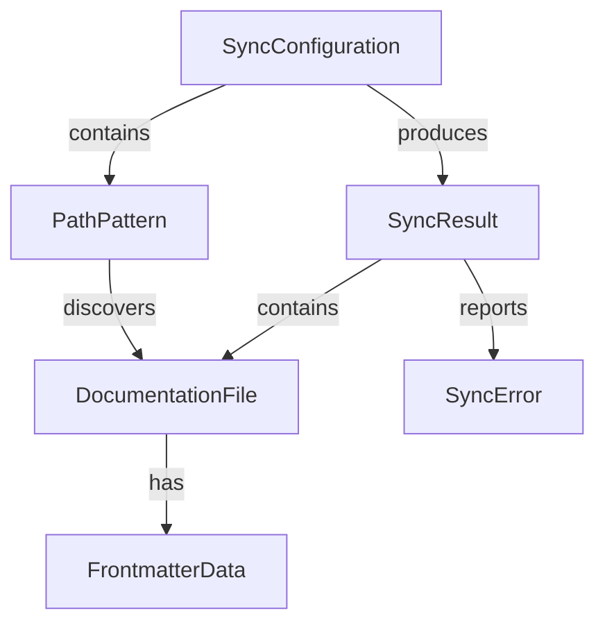

# Data Model - Documentation-by-Code System

## Core Entities

### DocumentationFile
Represents a single documentation file in the system.

**Fields**:
- `sourcePath`: string - Absolute path to the source .mdx/.md file
- `destPath`: string - Absolute path to the destination in docs site
- `type`: 'command' | 'service' | 'guide' | 'about' | 'contributing' | 'architecture' - Documentation category
- `name`: string - Extracted name (command/service/guide identifier)
- `frontmatter`: FrontmatterData - Parsed or generated frontmatter
- `content`: string - Raw markdown/MDX content
- `lastModified`: Date - Last modification timestamp
- `checksum`: string - Content hash for change detection

**Validation Rules**:
- sourcePath must exist and be readable
- destPath must be writable location
- type determines path mapping rules
- name must be valid identifier (alphanumeric + hyphens)

### FrontmatterData
Metadata for each documentation page.

**Fields**:
- `title`: string - Page title (required)
- `description`: string - Brief description (required)
- `sidebar_label`: string - Navigation label (optional, defaults to title)
- `sidebar_position`: number - Order in sidebar (optional)
- `keywords`: string[] - Search keywords (optional)
- `hide_title`: boolean - Hide title in rendered page (optional)

**Validation Rules**:
- title must be non-empty string
- description should be under 160 characters
- sidebar_position must be positive integer if provided

### SyncConfiguration
Configuration for the synchronization process.

**Fields**:
- `sourcePatterns`: PathPattern[] - Patterns for finding source docs
- `outputDir`: string - Base directory for Docusaurus docs
- `watch`: boolean - Enable file watching mode
- `clean`: boolean - Remove orphaned files
- `validate`: boolean - Validate MDX during sync
- `preserveExtensions`: boolean - Keep .md vs .mdx distinction

**Default Values**:
```typescript
{
  sourcePatterns: [
    { pattern: 'src/specify_cli/commands/*/docs.{md,mdx}', type: 'command' },
    { pattern: 'src/specify_cli/services/*/docs.{md,mdx}', type: 'service' },
    { pattern: 'src/specify_cli/assistants/*/docs.{md,mdx}', type: 'assistant' },
    { pattern: 'src/specify_cli/guides/*.{md,mdx}', type: 'guide' },
    { pattern: 'src/specify_cli/about/*.{md,mdx}', type: 'about' },
    { pattern: 'src/specify_cli/contributing/*.{md,mdx}', type: 'contributing' },
    { pattern: 'architecture/**/*.mdx', type: 'architecture' }
  ],
  outputDir: 'docs/docs',
  watch: false,
  clean: true,
  validate: true,
  preserveExtensions: true
}
```

### PathPattern
Defines a pattern for discovering documentation files.

**Fields**:
- `pattern`: string - Glob pattern for matching files
- `type`: 'command' | 'service' | 'guide' | 'about' | 'contributing' | 'architecture' - Documentation type
- `outputSubdir`: string - Subdirectory in output (e.g., 'reference/cli')

**Mapping Rules**:
- command → docs/reference/cli/
- service → docs/reference/api/
- assistant → docs/reference/assistants/
- guide → docs/guides/
- about → docs/about/
- contributing → docs/contributing/
- architecture → docs/architecture/

### SyncResult
Result of a synchronization operation.

**Fields**:
- `filesProcessed`: number - Count of files synchronized
- `filesAdded`: DocumentationFile[] - New files added
- `filesUpdated`: DocumentationFile[] - Existing files updated
- `filesRemoved`: string[] - Paths of removed files
- `errors`: SyncError[] - Any errors encountered
- `duration`: number - Sync duration in milliseconds

### SyncError
Error encountered during synchronization.

**Fields**:
- `file`: string - File path that caused error
- `error`: string - Error message
- `type`: 'parse' | 'validate' | 'write' | 'unknown' - Error category
- `recoverable`: boolean - Whether sync can continue

## State Transitions

### Documentation File States
```
DISCOVERED → VALIDATED → PROCESSED → SYNCED
    ↓            ↓           ↓
  SKIPPED     INVALID     FAILED
```

### Sync Process States
```
IDLE → SCANNING → PROCESSING → COMPLETING → IDLE
         ↓            ↓            ↓
      WATCHING     ERRORED     CANCELLED
```

## Relationships



## Validation Rules

### Global Constraints
1. No duplicate destination paths (would overwrite files)
2. All source paths must be within project root
3. Output directory must be within docs project
4. File names must be URL-safe (no spaces, special chars)

### Business Rules
1. Commands without docs.mdx should be reported as warnings
2. Services marked as public must have documentation
3. Removed source files trigger destination cleanup
4. Frontmatter title extraction falls back to directory name

## Index Requirements

For efficient operations, maintain indices on:
- sourcePath (for change detection)
- destPath (for conflict detection)
- type (for grouped operations)
- lastModified (for incremental sync)
